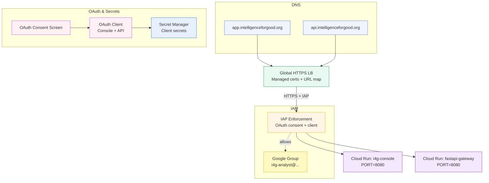

# IAP OAuth Brand & Client Manual Guide

This guide provides step-by-step instructions to manually configure the OAuth Consent Screen and OAuth Client required for Identity-Aware Proxy (IAP).

## Architecture (IAP + LB + Cloud Run)



## Prerequisites

- **Permission**: You need `Project Editor` or `OAuth Config Editor` roles.
- **Audience Decision**:
  - **Internal (Recommended)**: Choose this if your project belongs to the `intelligenceforgood.org` Google Cloud Organization. This allows you to control access via IAM groups (like `i4g-analyst@intelligenceforgood.org`) without managing individual "Test Users".
  - **External**: Choose this only if you do not have a Google Workspace Organization. You will be limited to a list of specific "Test Users" unless you go through a verification process.

---

## Step 1: Configure OAuth Consent Screen

**Note**: The Google Cloud Console UI has recently changed. You may see a "Google Auth Platform" view with tabs like **Branding**, **Audience**, and **Data Access**.

1.  Log in to the **Google Cloud Console** and select your project (e.g., `i4g-dev`).
2.  Navigate to **APIs & Services** > **OAuth consent screen** (or search for "Branding").

### Tab: Audience (User Type)
*This is where you define who can access your app.*
1.  Click the **Audience** tab.
2.  **User Type**:
    *   Select **Internal** (Recommended for `intelligenceforgood.org` organization). This allows access control via Google Groups.
    *   Select **External** (Only if you have no Organization). Requires adding individual "Test Users".
3.  **Test Users** (External only):
    *   If External, add specific email addresses here.

### Tab: Branding (App Info)
*This is where you define what users see on the consent screen.*
1.  Click the **Branding** tab.
2.  **App Information**:
    *   **App name**: Enter `Intelligence for Good Analyst Platform`.
    *   **User support email**: Select your email address.
3.  **App Domain**:
    *   **Application home page**: `https://app.intelligenceforgood.org`
    *   **Authorized domains**: Click **Add Domain** and enter `intelligenceforgood.org`.
4.  **Developer Contact Information**:
    *   Enter your email address (e.g., `jerry@intelligenceforgood.org`).
5.  Click **Save**.

### Tab: Data Access (Scopes)
*This is where you define what data the app can access.*
1.  Click the **Data Access** tab.
2.  Click **Add or Remove Scopes**.
3.  In the filter list, select the checkboxes for:
    *   `.../auth/userinfo.email`
    *   `.../auth/userinfo.profile`
    *   `openid`
4.  Click **Update** and then **Save**.

### Reference
*   **Official Guide**: [Configure the OAuth consent screen](https://developers.google.com/workspace/guides/configure-oauth-consent) (Most up-to-date resource).

---

## Step 2: Create OAuth Client ID

1.  Navigate to **APIs & Services** > **Credentials**.
2.  Click **+ Create Credentials** at the top and select **OAuth client ID**.
3.  **Application type**: Select **Web application**.
4.  **Name**: Enter `IAP Client - Console`.
5.  **Authorized JavaScript origins**:
    *   Click **Add URI**.
    *   Enter: `https://app.intelligenceforgood.org`
6.  **Authorized redirect URIs**:
    *   Click **Add URI**.
    *   Enter: `https://app.intelligenceforgood.org/api/auth/callback/google` (Standard for NextAuth.js/Auth.js if used).
    *   Click **Add URI**.
    *   Enter: `https://iap.googleapis.com/v1/oauth/clientIds/YOUR_CLIENT_ID_HERE:handleRedirect`
        *   *Note*: Replace `YOUR_CLIENT_ID_HERE` with the actual Client ID generated in this step. This URI is required for IAP to function correctly.
    *   Click **Add URI**.
    *   Enter: `https://app.intelligenceforgood.org/_gcp_gatekeeper/authenticate` (Required for IAP to handle authentication callbacks).
7.  Click **Create**.
8.  **Important**: A popup will show "OAuth client created".
    *   Copy the **Client ID**.
    *   Copy the **Client Secret**.
    *   Store these temporarily in a secure note.

---

## Step 3: Store Secrets in Secret Manager

You need to store the Client Secret in Google Secret Manager so Terraform and the application can access it.

1.  Open the **Cloud Shell** (icon in top right) or use your local terminal.
2.  Run the following command (replace placeholders):

```bash
# Set your variables
export PROJECT_ID="i4g-dev"  # or i4g-prod
export SECRET_ID="iap-client-console"
export CLIENT_SECRET="YOUR_COPIED_CLIENT_SECRET"

# Create the secret (if it doesn't exist)
gcloud secrets create $SECRET_ID --replication-policy="automatic" --project=$PROJECT_ID || true

# Add the secret version
printf "$CLIENT_SECRET" | gcloud secrets versions add $SECRET_ID --data-file=- --project=$PROJECT_ID
```

3.  Repeat this process if you have a separate client for the API (e.g., `iap-client-fastapi`).

---

## Step 4: Apply Configuration & Verify

Once the OAuth clients are created and secrets are stored (or available to be passed as variables), you must apply the Terraform configuration to deploy the Load Balancer and enable IAP.

1.  **Apply Terraform**:
    Run the following command in your terminal, ensuring you provide the Client IDs and Secrets you just created.

    ```bash
    # Export your secrets (avoid committing these to git)
    export TF_VAR_iap_client_id_console="YOUR_CONSOLE_CLIENT_ID"
    export TF_VAR_iap_client_secret_console="YOUR_CONSOLE_CLIENT_SECRET"
    export TF_VAR_iap_client_id_api="YOUR_API_CLIENT_ID"      # Can be same as console if sharing client
    export TF_VAR_iap_client_secret_api="YOUR_API_CLIENT_SECRET"

    # Apply the changes
    conda run -n i4g terraform -chdir=environments/app/dev apply
    ```

2.  **Update DNS**:
    *   After Terraform applies, it will output a global IP address for the Load Balancer.
    *   Update your DNS records (A records) for `app.intelligenceforgood.org` and `api.intelligenceforgood.org` to point to this new IP.
    *   *Note*: It may take 10-20 minutes for the Google Managed SSL certificates to provision. During this time, you may see SSL errors.

3.  **Verify Access**:
    *   Open an Incognito window.
    *   Navigate to `https://app.intelligenceforgood.org`.
    *   You should be redirected to the Google Sign-In page (the OAuth Consent Screen you configured).
    *   Sign in with an allowed account (e.g., a member of `i4g-analyst@intelligenceforgood.org`).
    *   You should successfully access the application.

