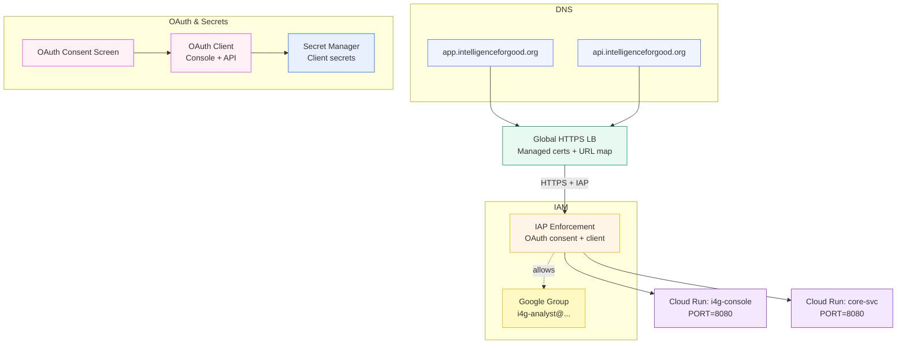

# IAP OAuth Brand & Client Manual Guide

This guide provides step-by-step instructions to manually configure the OAuth Consent Screen and OAuth Client required for Identity-Aware Proxy (IAP).

## Architecture (IAP + LB + Cloud Run)


```mermaid
flowchart TD
    subgraph DNS
        A[app.intelligenceforgood.org]:::dns
        B[api.intelligenceforgood.org]:::dns
    end

    A --> LB[Global HTTPS LB<br/>Managed certs + URL map]:::lb
    B --> LB

    LB -->|HTTPS + IAP| IAP[IAP Enforcement<br/>OAuth consent + client]:::iap

    subgraph OAuth & Secrets
        OCS[OAuth Consent Screen]:::config
        OCI[OAuth Client<br/>Console + API]:::config
        SM[Secret Manager<br/>Client secrets]:::secret
        OCS --> OCI --> SM
    end

    IAP --> CON[Cloud Run: i4g-console<br/>PORT=8080]:::run
    IAP --> API[Cloud Run: core-svc<br/>PORT=8080]:::run

    subgraph IAM
        G[Google Group<br/>i4g-analyst@...]:::iam
        IAP -. allows .-> G
    end

    classDef dns fill:#f0f4ff,stroke:#4c6fff,stroke-width:1;
    classDef lb fill:#e7f9f0,stroke:#0f9d58,stroke-width:1;
    classDef iap fill:#fff5e6,stroke:#f4b400,stroke-width:1;
    classDef run fill:#f3e8ff,stroke:#9333ea,stroke-width:1;
    classDef secret fill:#e8f0fe,stroke:#1a73e8,stroke-width:1;
    classDef config fill:#fff0f5,stroke:#d946ef,stroke-width:1;
    classDef iam fill:#fef9c3,stroke:#eab308,stroke-width:1;
```

## Prerequisites

- **Permission**: You need `Project Editor` or `OAuth Config Editor` roles.
- **Audience Decision**:
  - **Internal (Recommended)**: Choose this if your project belongs to the `intelligenceforgood.org` Google Cloud Organization. This allows you to control access via IAM groups (like `i4g-analyst@intelligenceforgood.org`) without managing individual "Test Users".
  - **External**: Choose this only if you do not have a Google Workspace Organization. You will be limited to a list of specific "Test Users" unless you go through a verification process.

---

## Step 1: Configure OAuth Consent Screen

**Note**: The Google Cloud Console UI has recently changed. You may see a "Google Auth Platform" view with tabs like **Branding**, **Audience**, and **Data Access**.

1.  Log in to the **Google Cloud Console** and select your project (e.g., `i4g-dev`).
2.  Navigate to **APIs & Services** > **OAuth consent screen** (or search for "Branding").

### Tab: Audience (User Type)

_This is where you define who can access your app._

1.  Click the **Audience** tab.
2.  **User Type**:
    - Select **Internal** (Recommended for `intelligenceforgood.org` organization). This allows access control via Google Groups.
    - Select **External** (Only if you have no Organization). Requires adding individual "Test Users".
3.  **Test Users** (External only):
    - If External, add specific email addresses here.

### Tab: Branding (App Info)

_This is where you define what users see on the consent screen._

1.  Click the **Branding** tab.
2.  **App Information**:
    - **App name**: Enter `Intelligence for Good Analyst Platform`.
    - **User support email**: Select your email address.
3.  **App Domain**:
    - **Application home page**: `https://app.intelligenceforgood.org`
    - **Authorized domains**: Click **Add Domain** and enter `intelligenceforgood.org`.
4.  **Developer Contact Information**:
    - Enter your email address (e.g., `jerry@intelligenceforgood.org`).
5.  Click **Save**.

### Tab: Data Access (Scopes)

_This is where you define what data the app can access._

1.  Click the **Data Access** tab.
2.  Click **Add or Remove Scopes**.
3.  In the filter list, select the checkboxes for:
    - `.../auth/userinfo.email`
    - `.../auth/userinfo.profile`
    - `openid`
4.  Click **Update** and then **Save**.

### Reference

- **Official Guide**: [Configure the OAuth consent screen](https://developers.google.com/workspace/guides/configure-oauth-consent) (Most up-to-date resource).

---

## Step 2: Create OAuth Client ID

A single OAuth client is used for both the console and API backends. The client must include authorized origins and redirect URIs for **both** domains.

1.  Navigate to **APIs & Services** > **Credentials**.
2.  Click **+ Create Credentials** at the top and select **OAuth client ID**.
3.  **Application type**: Select **Web application**.
4.  **Name**: Enter `IAP Client`.
5.  **Authorized JavaScript origins** — add both domains:
    - `https://app.intelligenceforgood.org`
    - `https://api.intelligenceforgood.org`
6.  **Authorized redirect URIs** — add all of the following:
    - `https://app.intelligenceforgood.org/api/auth/callback/google` (NextAuth.js callback)
    - `https://app.intelligenceforgood.org/_gcp_gatekeeper/authenticate`
    - `https://api.intelligenceforgood.org/_gcp_gatekeeper/authenticate`
    - `https://iap.googleapis.com/v1/oauth/clientIds/YOUR_CLIENT_ID_HERE:handleRedirect`
      - _Note_: Replace `YOUR_CLIENT_ID_HERE` with the actual Client ID generated in this step. This URI is required for IAP to function correctly.
7.  Click **Create**.
8.  **Important**: A popup will show "OAuth client created".
    - Copy the **Client ID** and **Client Secret**. Store these temporarily in a secure note.

---

## Step 3: Add Credentials to `local-overrides.tfvars`

Terraform receives the OAuth client credentials through a single `iap_clients` variable defined in the gitignored file `local-overrides.tfvars`. This file lives inside each environment directory and is **never committed** to version control.

1.  Navigate to the target environment directory:

    ```bash
    cd infra/environments/app/prod   # or dev
    ```

    > **Note:** Environment directories are thin wrappers — all IAP resource
    > logic lives in `infra/stacks/app/`. To change IAP configuration, edit
    > `infra/stacks/app/iap.tf` (or equivalent); the environment wrapper only
    > supplies variable values via `terraform.tfvars`.

2.  Open (or create) `local-overrides.tfvars` and add the `iap_clients` block using the same Client ID and Secret for both `api` and `console`:

    ```hcl
    iap_clients = {
      api = {
        client_id     = "YOUR_CLIENT_ID"
        client_secret = "YOUR_CLIENT_SECRET"
      }
      console = {
        client_id     = "YOUR_CLIENT_ID"
        client_secret = "YOUR_CLIENT_SECRET"
      }
    }
    ```

    - Both entries use the same credentials from the single OAuth client created in Step 2.
    - The file is matched by `*local-overrides.tfvars` in `.gitignore`, so it stays out of version control.

---

## Step 4: Apply Configuration & Verify

Each environment directory contains a `Makefile` that wraps Terraform commands and automatically passes `-var-file=local-overrides.tfvars`. All plan/apply operations should use these Make targets.

1.  **Initialize Terraform** (first time only, or after provider/module changes):

    ```bash
    cd infra/environments/app/prod   # or dev
    make init
    ```

2.  **Plan**:

    ```bash
    make plan
    ```

    Review the plan output. Confirm the `google_compute_backend_service` resources show `iap.enabled = true` with the correct client IDs.

3.  **Apply**:

    ```bash
    make apply
    ```

    This runs `terraform apply -var-file=local-overrides.tfvars -auto-approve`.

4.  **Update DNS** (first-time setup only):
    - After Terraform applies, it outputs a global IP address for the Load Balancer.
    - Update your DNS A records for `app.intelligenceforgood.org` and `api.intelligenceforgood.org` to point to this IP.
    - _Note_: Google Managed SSL certificates may take 10–20 minutes to provision. You may see SSL errors during this window.

5.  **Verify Access**:
    - Open an Incognito window.
    - Navigate to `https://app.intelligenceforgood.org`.
    - You should be redirected to the Google Sign-In page (the OAuth Consent Screen you configured).
    - Sign in with an allowed account (e.g., a member of `i4g-analyst@intelligenceforgood.org`).
    - You should successfully access the application.
